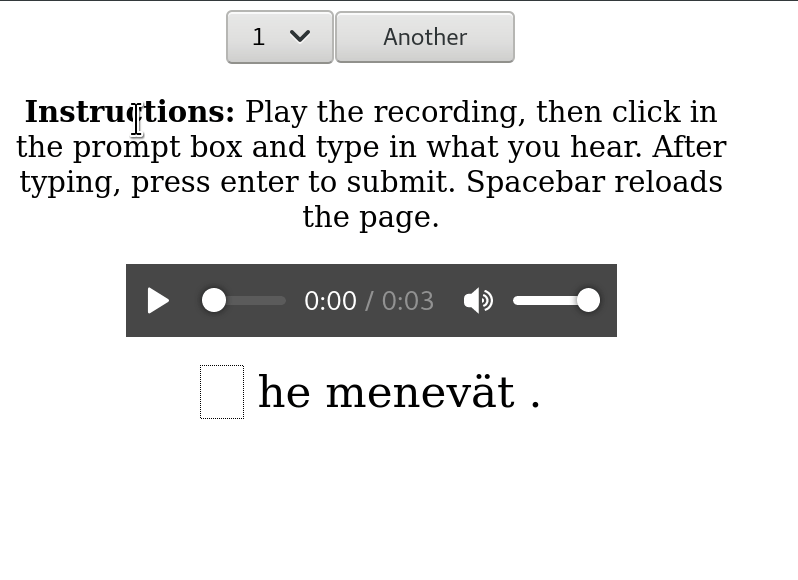

# OmniLingo

 

# What is this?

The goal of the project is to help you practice listening comprehension.

It works by giving you random sentences in the language you're learning and
asking you to fill in the gaps. The sentences were submitted by contributors
to [Mozilla Common Voice](https://commonvoice.mozilla.org/) platform.

The sentences are ranked according to difficulty, and you can choose a level
from 1 to 10 where 1 is the easiest and 10 is the hardest.

The project aims to not require any knowledge of a meta language in order to start
learning. 

# Tasks

* Fill in the blanks: A cloze-style task
* Pick the right one: Get two options and choose the right one
* Drag and drop: Get a set of tiles and drag them to build a sentence

# Keys

* `Tab`: Play the recording
* `Enter`: Submit and check if you got it right
* `Space`: Next sentence

# Data

The data comes from the Common Voice [dataset releases](http://commonvoice.mozilla.org/datasets).

# Target audience

This system is designed with two main user groups in mind:

* People who want to learn a new language
* People who want to learn how to write their native language

The system endeavours to be audio first, with knowledge of writing built 
up by hearing.

# Talk to us!

* IRC: `irc.freenode.net` `#OmniLingo`
* Matrix: `#OmniLingo:matrix.org`  (access via [Element](https://app.element.io/#/room/#OmniLingo:matrix.org))
* Telegram: [OmniLingo](https://t.me/omnilingo)

# Available languages

All of the languages available in Common Voice 6.1 dataset.

# Deployment

To bootstrap the project for Finnish, `git clone` the repository, then run the following
commands:

```bash
cd templates && wget --no-check-certificate http://cl.indiana.edu/\~ftyers/cv/cv-corpus-6.1-2020-12-11.tar.gz -O- | tar zxf - && cd ..
pip install -r requirements.txt
./main.py
```

To add more languages, download a dataset from [Common Voice](https://commonvoice.mozilla.org/datasets) and 
put it in `templates/cv-corpus-6.1-2020-12-11`.

The project should be accessible through http://localhost:5001/

Happy hacking! :)
